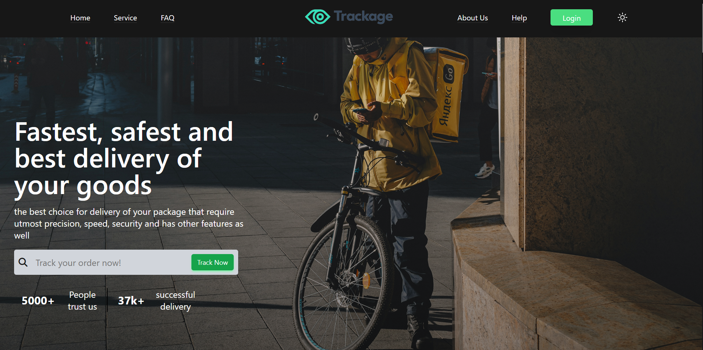

---

marp: true
paginate: true
class: invert

---


# Courier tracking Website

---

# The Question

---

# Technologies
+ For the Front-end we have used
    + HTML
    + Tailwind
    + JavaScript
    + ScrollMagic 
    + SwiperJS

+ For the Back-end we have used
    + Google geolocation API
    + PhP
    + Sql

---

# Mode Toggle
+ Now every website needs to be in both Light and Dark Mode for users as everyone has different preference 

```js
    if(document.documentElement.classList.contains("dark")){
        document.documentElement.classList.remove("dark")
        localStorage.setItem("theme","light")
        iconToggle()
        return
    }
    document.documentElement.classList.add("dark")
    localStorage.setItem("theme","dark")
    iconToggle()
```
+ We used JS to let user switch between the modes

---

# Tracking Section

We have the first section where user can input their `tracking number` into the input field to check the status of their package



---

# Scroll Animations
+ We used ScrollMagic to add animations to different parts of site that take place when user scrolls to that section 

```js
var controller = new ScrollMagic.Controller() 
```

+ What scrollMagic does is it uses `scrollbar` as controller, we set different trigger points and when scrollbar reaches their it adds the animation class to the component

```js 
var scene5 = new ScrollMagic.Scene({
        triggerElement: '.section5',
        triggerHook: .6, // decides the time when animation should start taking place
    })
    .setClassToggle('.section5','fade-in')
    .addTo(controller)
```

Just an example of how we use `scrollMagic` to add animations

---

# Provided services

We added a section to let user know that the company delivers to distant places as well through various modes of transport and not just nearby places

+ Seeing these kind of information is much easier and attractive when shown in card forms to seprate them and explain in less words

---

# Testimonials

New customer always look for reviews on the product they want to buy so `testimonials` go a long way in acquiring new customers

+ Showing all the reviews together can be jaring so we decided to make the reviews in a `carousel` form 

+ Making a carousel from scratch was possible but we instead with `swiperJS` 

+ Swiper Js made the carousel so easy as we just have to add the content we want and style it. It takes cares of the functionality, uses Jquery to make it happen.

```js 
      const swiper = new Swiper('.swiper', {
      // Optional parameters
      speed: 500,
      spaceBetween: 150,
      autoplay: {
        delay: 3000
    },});
```

---

# FAQ

There are some common most asked questions on every site, we displayed that section in `accordian` form. This section is made completely using Tailwind.


---

# Support

Many-a-times users have question that aren't displayed on site and they have no way of clearing them online. So a `support` section is good to have 

+ Best way to answer those questions is through email

+ We used `<a href="mailto:">` tag to let user just click on the link and this will direct them to email section and they can send their question easily